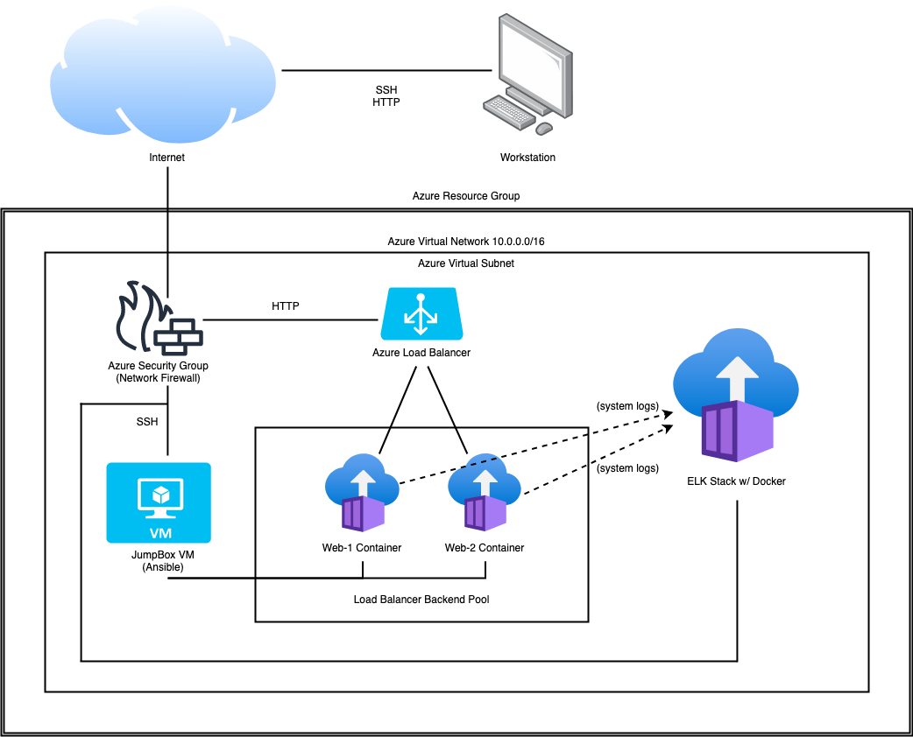

# Network and Cloud Security Project

This project involved the creation of a cloud environment with a Jump Box and two containers designed to share the load of keeping a single website running, even if one of the containers fails.

I've included the YAML files I used to launch and configure the cloud servers with docker containers via Ansible. In total, the final product involved a Jump Box server, two docker containers, and an ELK Stack which was used to monitor the log files of the docker containers via FileBeat and MetricBeat.

