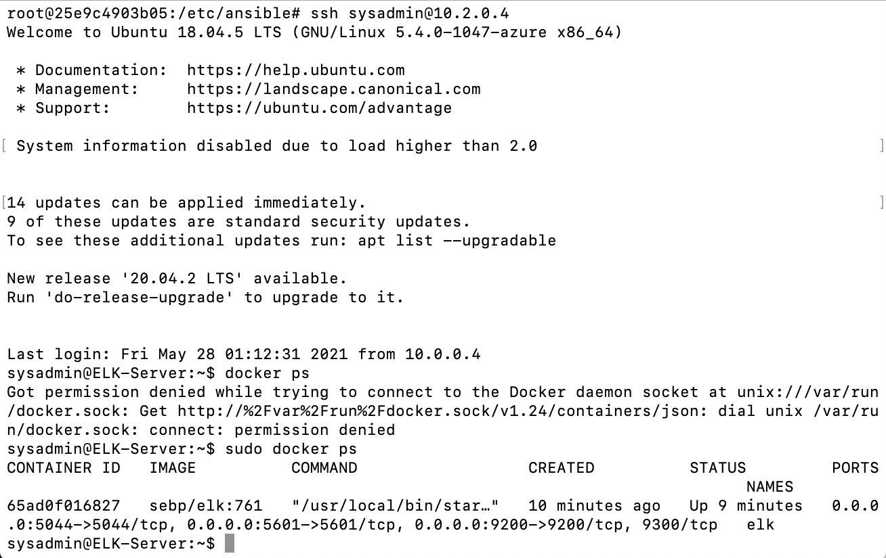

## Network and Cloud Security Project

This project involved the creation of a cloud environment with a Jump Box and two containers designed to share the load of keeping a single website running, even if one of the containers were to fail.

Included are the YAML files I used to launch and configure the cloud servers with docker containers via Ansible. The files have been tested and used to generate a live ELK deployment on Azure, and they can be used to recreate the entire deployment pictured below. In total, the final product involved a Jump Box server, two docker containers, and an ELK Stack which was used to monitor the log files of the docker containers via FileBeat and MetricBeat.

This document contains the following details:
- Description of the Topology
- Access Policies
- ELK Configuration
  - Beats in Use
  - Machines Being Monitored

### Description of the Topology

The main purpose of this network is to create a load-balanced and monitored instance of DVWA (Damn Vulnerable Web Application). Load balancing ensures that the application will remain highly available, and the use of a Jump Box allows us to restrict unauthorized access to the network. 

By integrating an ELK server, we allow the user to easily monitor all changes to specific, sensitive files on the vulnerable VMs via Filebeat, as well as any host metrics via Metricbeat.

The configuration details of each machine may be found below.

| Name       | Function         | Private | Public IP Address  | Operating System |
|------------|------------------|------------------------------|------------------|
| Jump Box   | Gateway          | 10.0.0.4 | 52.149.181.114    | Linux            |
| Web-1      | Docker Container | 10.0.0.6 | 13.92.17.5        | Linux            |
| Web-2      | Docker Container | 10.0.0.7 | 13.92.17.5        | Linux            |
| ELK Server | Log Monitor      | 10.2.0.4                     | Linux            |

### Access Policies

By creating a Security Group within Azure, the Jump Box and ELK Server are not exposed to the public Internet (with the exception of a single IP of the administrator for the sake of SSH access to the Jump Box). Only the Web-1 and Web-2 machines can accept port 80 connections from the Internet, managed by the Load Balancer. The Jump Box and the ELK Server can only be accessed by the administrator's IP address: 136.49.68.20.

A summary of the access policies in place can be found in the table below.

| Name       | Publicly Accessible | Allowed IP Addresses   |
|------------|---------------------|------------------------|
| Jump Box   | No/Restricted       | 136.49.68.20           |
| Web-1      | Yes                 | Any                    |
| Web-2      | Yes                 | Any                    |
| ELK Server | No/Restricted       | 10.0.0.4 136.49.68.20  |

### Elk Configuration

Ansible was used to automate configuration of the ELK Server. No configuration was performed manually, which is advantageous because this largely reduces the risk of human error in the process.

The playbook implements the following tasks:
- Install docker.io
- Install pip3
- Install docker python module
- Increase memory usage
- Download/launch docker ELK container
- Enable service docker on boot

The following screenshot displays the result of running `docker ps` after successfully configuring the ELK instance.

### Target Machines & Beats
This ELK server is configured to monitor the following machines:
- Web-1 @ 10.0.0.6
- Web-2 @ 10.0.0.7

The following Beats are installed on these machines:
- Filebeat
- Metricbeat

These Beats allow us to collect the following information from each machine:
- Filebeat allows us to monitor system logs of any specified file, when and how they have been accessed. This is useful in making sure that sensitive files stay secure and managed properly.
- Metricbeat allows us to monitor system performance metrics such as memory and CPU usage, in addition to other container performance metrics. 

